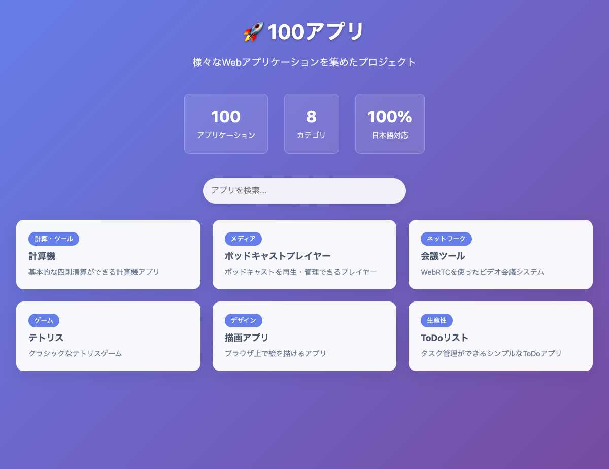
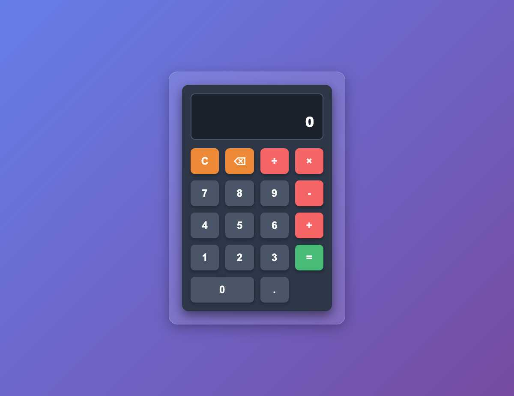
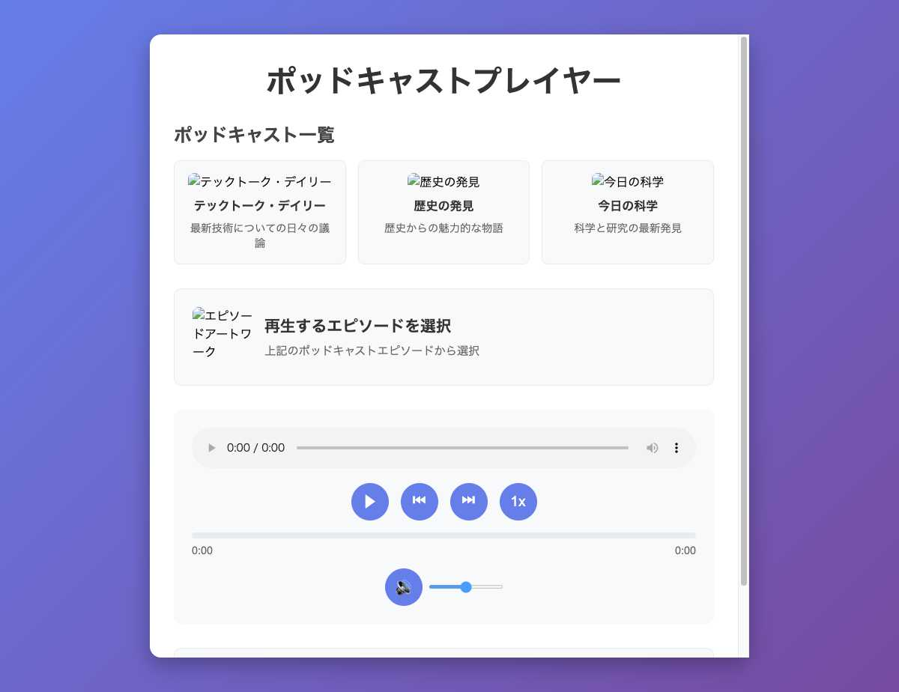
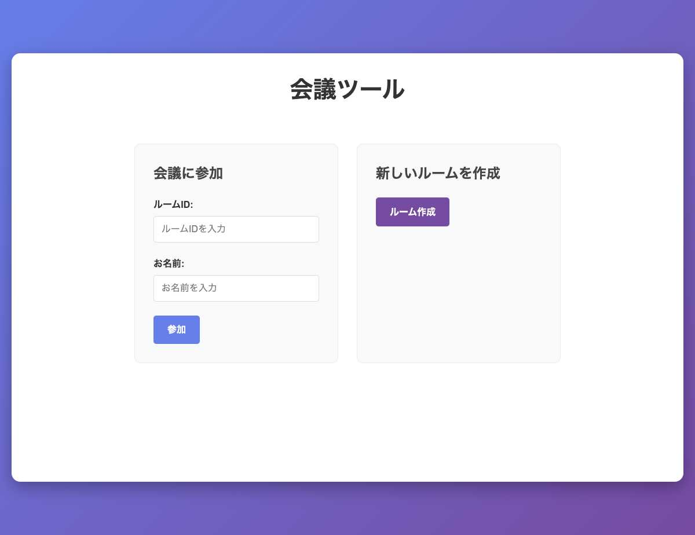
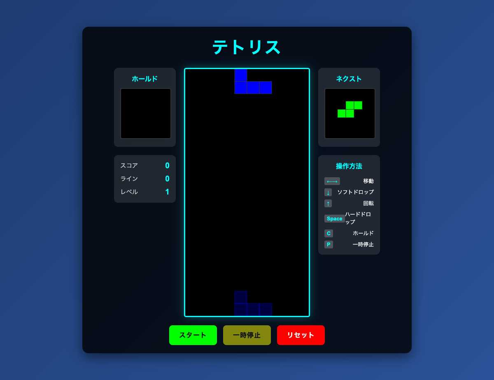
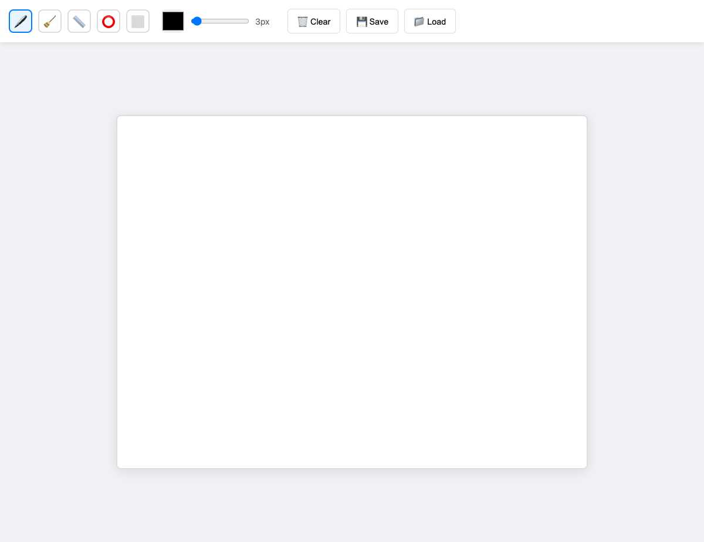

# 100アプリ - Webアプリケーション集

100種類の様々なWebアプリケーションを集めたプロジェクトです。教育、エンターテイメント、ユーティリティ、ゲームなど幅広いカテゴリのアプリケーションが含まれています。

## 📸 スクリーンショット

### メインランチャー
<div align="center">
  
</div>

### サンプルアプリケーション
<div align="center">
  
  
  
  
  
</div>

## 🚀 開始方法

### 前提条件

- Node.js (v18以上)
- npm または yarn

### インストール

```bash
# リポジトリをクローン
git clone https://github.com/M-Miyazako/100apps.git
cd 100apps/launcher

# 依存関係をインストール
npm install
```

### 開発サーバーの起動

```bash
# 開発サーバーを起動
npm run dev

# ブラウザで http://localhost:[port] にアクセス
```

### ビルド

```bash
# 本番用ビルド
npm run build

# プレビュー
npm run preview
```

## 📱 アプリケーション一覧

### 🧮 計算・ツール系
- **app-001-calculator**: 基本計算機
- **app-002-todo**: ToDoリストアプリ
- **app-003-stopwatch**: ストップウォッチ
- **app-008-timer**: タイマー
- **app-009-password-generator**: パスワード生成器
- **app-010-qr-generator**: QRコード生成器
- **app-011-text-counter**: 文字数カウンター
- **app-014-unit-converter**: 単位変換器
- **app-021-bmi-calculator**: BMI計算機
- **app-022-hash-generator**: ハッシュ生成器

### 🎮 ゲーム系
- **app-004-rock-paper-scissors**: じゃんけんゲーム
- **app-012-coin-flip**: コイントス
- **app-018-bingo**: ビンゴゲーム
- **app-019-memory-game**: 記憶ゲーム
- **app-020-number-guessing**: 数字当てゲーム
- **app-023-dice-game**: サイコロゲーム
- **app-024-tetris**: テトリス
- **app-027-snake-game**: スネークゲーム
- **app-030-quiz-app**: クイズアプリ
- **app-032-color-game**: 色ゲーム
- **app-036-rock-game**: ロックゲーム
- **app-037-simple-game**: シンプルゲーム
- **app-038-modern-game**: モダンゲーム
- **app-039-fantasy-game**: ファンタジーゲーム
- **app-040-adventure-game**: アドベンチャーゲーム
- **app-041-shooting-game**: シューティングゲーム
- **app-042-word-game**: 単語ゲーム

### 🎨 デザイン・メディア系
- **app-005-color-picker**: カラーピッカー
- **app-025-music-player**: 音楽プレイヤー
- **app-028-media-player**: メディアプレイヤー
- **app-046-drawing-app**: 描画アプリ
- **app-047-voice-recorder**: 音声録音
- **app-049-image-editor**: 画像編集
- **app-055-video-player**: ビデオプレイヤー
- **app-056-audio-editor**: オーディオ編集
- **app-076-color-palette**: カラーパレット
- **app-077-font-manager**: フォント管理
- **app-078-icon-library**: アイコンライブラリ
- **app-079-gradient-generator**: グラデーション生成器
- **app-080-css-generator**: CSS生成器

### 💼 ビジネス・生産性
- **app-031-exercise-tracker**: 運動記録
- **app-034-shopping-list**: 買い物リスト
- **app-044-expense-tracker**: 支出記録
- **app-045-habit-tracker**: 習慣記録
- **app-048-file-manager**: ファイル管理
- **app-060-bookmark-manager**: ブックマーク管理
- **app-061-note-taking**: メモ記録
- **app-062-time-tracker**: 時間記録
- **app-063-project-manager**: プロジェクト管理
- **app-064-kanban-board**: カンバンボード
- **app-065-gantt-chart**: ガントチャート
- **app-066-mind-map**: マインドマップ
- **app-067-flow-chart**: フローチャート

### 🌐 ネットワーク・通信
- **app-026-chat-app**: チャットアプリ
- **app-057-social-network**: SNS
- **app-058-chat-bot**: チャットボット
- **app-059-url-shortener**: URL短縮
- **app-088-forum-app**: フォーラムアプリ
- **app-090-news-reader**: ニュースリーダー
- **app-091-rss-reader**: RSSリーダー
- **app-092-podcast-player**: ポッドキャストプレイヤー
- **app-095-webrtc-chat**: WebRTCチャット
- **app-096-conference-tool**: 会議ツール
- **app-097-screen-share**: スクリーンシェア
- **app-098-remote-desktop**: リモートデスクトップ

### 🔧 開発・技術系
- **app-050-pdf-viewer**: PDF閲覧
- **app-051-spreadsheet**: スプレッドシート
- **app-052-presentation-tool**: プレゼンテーション
- **app-053-code-editor**: コードエディター
- **app-054-terminal-emulator**: ターミナルエミュレーター
- **app-072-database-viewer**: データベースビューア
- **app-073-api-tester**: API テスター
- **app-074-json-formatter**: JSONフォーマッター
- **app-075-regex-tester**: 正規表現テスター
- **app-081-html-builder**: HTMLビルダー
- **app-082-javascript-playground**: JavaScriptプレイグラウンド
- **app-083-markdown-editor**: Markdownエディター
- **app-084-latex-editor**: LaTeXエディター

### 📚 コンテンツ管理
- **app-085-documentation-tool**: ドキュメンテーション
- **app-086-blog-platform**: ブログプラットフォーム
- **app-087-cms-tool**: CMS ツール
- **app-089-wiki-editor**: Wiki エディター

### 🔍 その他
- **app-006-weather**: 天気予報
- **app-007-notes**: メモ
- **app-013-form-validator**: フォーム検証
- **app-015-name-generator**: 名前生成器
- **app-016-calendar**: カレンダー
- **app-017-morse-code**: モールス信号
- **app-029-translation-tool**: 翻訳ツール
- **app-033-barcode-generator**: バーコード生成器
- **app-035-recipe-finder**: レシピ検索
- **app-043-weather-widget**: 天気ウィジェット
- **app-068-wireframe-tool**: ワイヤーフレームツール
- **app-069-mockup-tool**: モックアップツール
- **app-070-design-system**: デザインシステム
- **app-071-style-guide**: スタイルガイド
- **app-093-video-streamer**: ビデオストリーマー
- **app-094-live-stream**: ライブストリーミング
- **app-099-vnc-viewer**: VNCビューア
- **app-100-system-monitor**: システムモニター

## 🛠️ 技術スタック

### フロントエンド
- **React 19.1.0**: UIライブラリ
- **TypeScript**: 型安全性
- **Vite**: ビルドツール
- **CSS3**: スタイリング

### 開発ツール
- **ESLint**: コード品質
- **Playwright**: E2Eテスト
- **Git**: バージョン管理

### アーキテクチャ
- **コンポーネントベース**: 再利用可能なReactコンポーネント
- **TypeScript**: 型安全性とコード品質
- **モジュラー設計**: 各アプリが独立した構造
- **レスポンシブデザイン**: モバイル対応

## 📁 プロジェクト構造

```
100apps/
├── launcher/                 # メインのランチャーアプリ
│   ├── src/
│   │   ├── components/      # Reactコンポーネント
│   │   ├── data/           # アプリケーションデータ
│   │   ├── hooks/          # カスタムフック
│   │   ├── types/          # TypeScript型定義
│   │   └── context/        # Reactコンテキスト
│   ├── apps/               # 個別のアプリケーション
│   │   ├── app-001-calculator/
│   │   ├── app-002-todo/
│   │   └── ...
│   ├── public/             # 静的ファイル
│   └── dist/               # ビルド出力
└── README.md
```

## 🔧 開発ガイド

### 新しいアプリの追加

1. `launcher/apps/` に新しいディレクトリを作成
2. 必要なファイルを追加 (`index.html`, `script.js`, `styles.css`)
3. `launcher/src/data/sampleApps.ts` にアプリ情報を追加

### コード品質

```bash
# ESLintチェック
npm run lint

# TypeScriptチェック
npm run build
```

### テスト

```bash
# E2Eテスト実行
npm test
```

## 📊 統計情報

- **総アプリ数**: 100個
- **カテゴリ数**: 8つ
- **対応言語**: 日本語
- **ブラウザ対応**: Chrome, Firefox, Safari, Edge
- **モバイル対応**: レスポンシブデザイン

## 🤝 貢献

このプロジェクトは学習・デモンストレーション目的で作成されています。

### 課題報告

バグや改善提案がありましたら、Issueを作成してください。

### 開発フロー

1. フォーク
2. 機能ブランチを作成
3. コミット
4. プルリクエストを作成

## 📄 ライセンス

このプロジェクトはMITライセンスの下で公開されています。

## 🌟 今後の予定

- [ ] PWA対応
- [ ] 多言語対応の拡張
- [ ] アプリ間の連携機能
- [ ] オフライン対応
- [ ] アクセシビリティ改善

## 📞 お問い合わせ

質問やフィードバックがありましたら、Issueを作成してください。

---

**注意**: このプロジェクトは教育・デモンストレーション目的で作成されています。実際の本番環境での使用には追加のセキュリティ対策や最適化が必要です。
